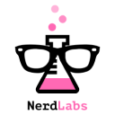

# mutambo

> The Game

## Waffle board

[https://waffle.io/nerd-labs/mutambo](https://waffle.io/nerd-labs/mutambo)

## Build Setup

``` bash
# install dependencies
npm install

# serve with hot reload at localhost:4545
npm run start
```

> Brewed by <a target="_blank" href="https://github.com/WartClaes">Wart</a> &amp; <a target="_blank" href="https://github.com/RobbertWolfs">Robbert</a>.



